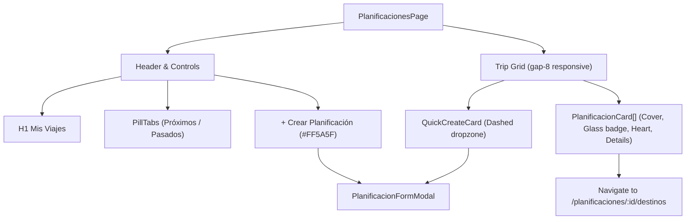

# Design: Planificaciones View & Travel Cards

## Architecture Overview

The Planificaciones view (/planificaciones) adopts the Wanderlog travel design language with pure white cards on a `#F7F9FA` background, `#FF5A5F` coral primary CTAs, pill tabs, and Lucide React iconography.



## Visual Tokens & Styling Rules

1. **Colors**:
   - Background: `#F7F9FA` (Clean Light Gray)
   - Cards: `#FFFFFF` with `shadow-sm hover:shadow-xl` (No hard borders)
   - Primary Accent / CTA: `#FF5A5F` (Vibrant Coral) with hover `#E0484D`
   - Secondary / Dark: `#222222`
   - Success / In-progress: `#10B981` (Emerald / Mint)
   - Input Backgrounds: `#F1F3F4` with no borders

2. **Components**:
   - `PillTabs`: Pill-shaped filter with smooth active pill background (`bg-white shadow-sm font-semibold text-slate-900`) and inactive tab (`text-slate-500 hover:text-slate-700`).
   - `QuickCreateCard`: Aspect-matched card with `border-2 border-dashed border-gray-300 hover:border-[#FF5A5F] hover:bg-rose-50/20`, circular '+' icon container, and accessible click handler.
   - `PlanificacionCard`: Pure white card, cover image with aspect ratio 16:9, glassmorphism badge (`bg-white/80 backdrop-blur-md shadow-sm`), floating heart button (`bg-white/90 backdrop-blur-sm`), title with line-clamp, description, and formatted dates with `Calendar` icon.
   - `PlanificacionFormModal`: Clean light modal matching modern design rules.

3. **Status Determination**:
   ```typescript
   export type TripStatus = 'UPCOMING' | 'IN_PROGRESS' | 'COMPLETED';

   export function getTripStatus(fechaInicio: string, fechaFin: string): TripStatus {
     const today = new Date();
     today.setHours(0, 0, 0, 0);
     const start = new Date(fechaInicio);
     const end = new Date(fechaFin);
     end.setHours(23, 59, 59, 999);

     if (today > end) return 'COMPLETED';
     if (today >= start && today <= end) return 'IN_PROGRESS';
     return 'UPCOMING';
   }
   ```
