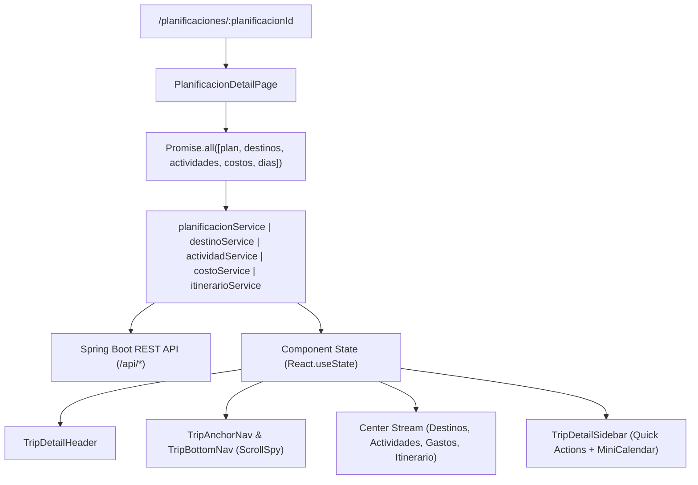

# Design: Planificacion Detail View (Detalle de Planificación)

## Technical Approach
Implement a unified 3-column travel planning dashboard at `/planificaciones/:planificacionId` using React 19, TypeScript strict mode, Tailwind CSS v4, and Lucide React. The page orchestrates five domain sub-modules: Trip Overview Header, Destinos, Actividades, Gastos (Expenses), and Itinerario (Chronological Timeline). It adheres to Wanderlog tokens: `#FFFFFF` rounded-2xl cards with soft shadows, `#F7F9FA` canvas background, `#FF5A5F` coral CTAs, `#222222` dark secondary controls, and `#10B981` budget indicators.

## Architecture Decisions

| Decision | Choice | Rationale | Alternatives Considered |
|---|---|---|---|
| **Layout Strategy** | 3-Column Grid (`lg:grid-cols-12`) | Left anchor nav (col-span-3), center content stream (col-span-6), right quick actions & calendar (col-span-3). Mobile collapses to single column with sticky bottom nav. | Tabs view (hides context), single long column without sticky nav. |
| **Scroll Spy** | `IntersectionObserver` API | High performance section tracking for active anchor pill highlights without scroll event throttling overhead. | `window.onscroll` listener (janky on low-end devices). |
| **Data Fetching** | Parallel `Promise.all` via Axios `apiClient` | Eliminates sequential waterfall by fetching plan details, destinations, activities, expenses, and itinerary days concurrently. | React Query / SWR (unnecessary extra dependency for current stack). |
| **Service Layer** | Centralized API modules using Axios `apiClient` | Standardizes auth cookies, error interceptors, and typed DTO contracts with Spring Boot endpoints. | Direct `fetch()` calls in components. |

## Data Flow



## File Changes

| File | Action | Purpose |
|---|---|---|
| `frontend/src/features/planificaciones/pages/PlanificacionDetailPage.tsx` | New | Main 3-column container, data orchestrator, and scrollspy coordinator. |
| `frontend/src/features/planificaciones/components/detail/TripDetailHeader.tsx` | New | Hero banner with cover photo, dates, status badge, and stats. |
| `frontend/src/features/planificaciones/components/detail/TripAnchorNav.tsx` | New | Left desktop sticky anchor navigation with pill highlights. |
| `frontend/src/features/planificaciones/components/detail/TripBottomNav.tsx` | New | Mobile sticky bottom navigation bar. |
| `frontend/src/features/planificaciones/components/detail/DestinosSection.tsx` | New | Destination cards (16:9), notes, and creation modal launcher. |
| `frontend/src/features/planificaciones/components/detail/ActividadesSection.tsx` | New | Activities grouped by destination with status/time badges. |
| `frontend/src/features/planificaciones/components/detail/GastosSection.tsx` | New | Expense categorization, `#10B981` summary badges, and total sum. |
| `frontend/src/features/planificaciones/components/detail/ItinerarioSection.tsx` | New | Chronological day tabs and time-slotted item list. |
| `frontend/src/features/planificaciones/components/detail/TripDetailSidebar.tsx` | New | Right sticky sidebar with quick creation buttons & mini-calendar. |
| `frontend/src/features/planificaciones/types/costo.ts` | New | TypeScript interfaces for `CostoRequestDTO` and `CostoResponseDTO`. |
| `frontend/src/features/planificaciones/types/itinerario.ts` | Modified | Align with Spring Boot DTOs (`DiaItinerarioResponseDTO`, `ItemItinerarioResponseDTO`). |
| `frontend/src/features/planificaciones/api/costoService.ts` | New | Axios service for `/api/costos` endpoints. |
| `frontend/src/features/planificaciones/api/itinerarioService.ts` | Modified | Refactor to Axios `apiClient` targeting `/api/itinerarios/*`. |
| `frontend/src/features/actividades/api/actividadService.ts` | Modified | Add `getByPlanificacion(planificacionId)` endpoint client. |
| `frontend/src/router/index.tsx` | Modified | Add `/planificaciones/:planificacionId` protected route. |
| `frontend/src/components/itinerary/PlanificacionCard.tsx` | Modified | Update card click navigation to `/planificaciones/:id`. |

## Interfaces & Contracts

```typescript
// Costos
export interface CostoRequestDTO {
  planificacionId: number;
  categoria: string;
  monto: number;
  descripcion: string;
}
export interface CostoResponseDTO {
  id: number;
  planificacionId: number;
  categoria: string;
  monto: number;
  descripcion: string;
}

// Itinerarios
export interface DiaItinerarioRequestDTO {
  planificacionId: number;
  fecha: string; // YYYY-MM-DD
}
export interface ItemItinerarioRequestDTO {
  diaItinerarioId: number;
  horaInicio?: string; // HH:mm
  horaFin?: string;    // HH:mm
  tipo: string;
  referenciaId?: number;
  notas?: string;
}
export interface ItemItinerarioResponseDTO {
  id: number;
  diaItinerarioId: number;
  horaInicio?: string;
  horaFin?: string;
  tipo: string;
  referenciaId?: number;
  notas?: string;
}
export interface DiaItinerarioResponseDTO {
  id: number;
  planificacionId: number;
  fecha: string;
  items?: ItemItinerarioResponseDTO[];
}
```

## Testing Strategy
- **Unit Tests**:
  - `costoService` and `itinerarioService` API calls (mocking Axios).
  - Expense calculation helper and date formatting.
- **Component Tests**:
  - `TripDetailHeader`: renders title, cover image, status badge, dates.
  - `TripAnchorNav`: highlights active section and handles click-to-scroll.
  - `GastosSection`: verifies budget calculations and `#10B981` styling.
  - `PlanificacionDetailPage`: validates parallel data loading, error states, and modal submissions.
  - `PlanificacionCard`: validates direct routing to `/planificaciones/:id`.

## Threat Matrix
*N/A — UI-only feature consuming authenticated backend APIs protected by JWT and Spring Security.*

## Migration / Rollout
Non-breaking additive change. The new route `/planificaciones/:planificacionId` seamlessly replaces destination-only redirects from `PlanificacionCard`.

## Open Questions
*None — Backend endpoints and DTO contracts are confirmed and fully implemented.*
